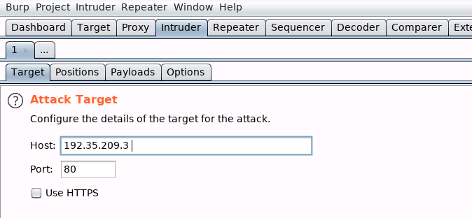
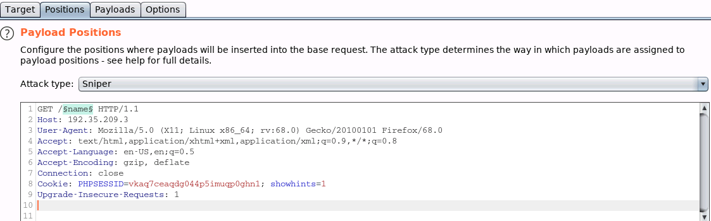
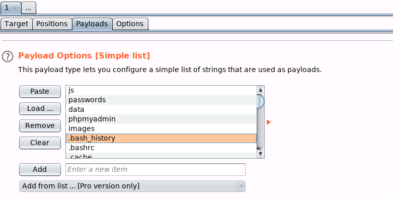
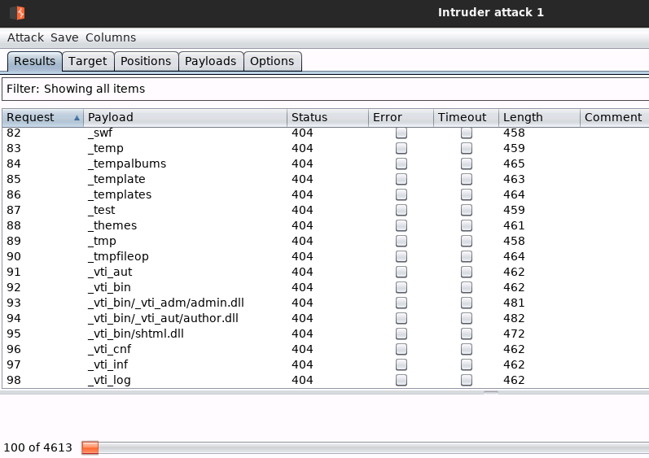

# Directory-enumeration-with-Burp-Suite
Let's introduce how to perform a Directory enumeration with Burp Suite
# Introduction of the tools
## Burp Suite
Burp Suite is a platform for web application security testing, vulnerability scanning, and penetration testing. It is written in Java and developed by PortSwigger, a company founded by Dafydd Stuttard. Burp Suite helps to identify and validate vulnerabilities and attack vectors that affect web applications. It is widely used by security professionals and penetration testers to evaluate the security of web applications.
Burp Suite provides various features and tools for web security testing, such as:

Burp Proxy: an intercepting proxy that allows you to modify and analyze HTTP(S) and WebSocket traffic between your browser and the target application.
Burp Scanner: an automated web vulnerability scanner that performs crawling and scanning of web applications to find common and complex vulnerabilities.
Burp Repeater: a tool that allows you to manually send and modify individual HTTP(S) requests and view the responses.
Burp Intruder: a tool that allows you to automate custom attacks on web applications by sending multiple variations of HTTP(S) requests and analyzing the responses.
Burp Decoder: a tool that allows you to decode and encode data using various methods, such as URL encoding, Base64, hex, etc.
Burp Comparer: a tool that allows you to compare two pieces of data to find differences or similarities.
Burp Sequencer: a tool that allows you to analyze the randomness and entropy of session tokens and other data.
Burp Collaborator: a service that allows you to perform out-of-band testing and discover server-side vulnerabilities that are not visible in the application’s responses.
Burp Extender: a feature that allows you to extend the functionality of Burp Suite by using BApp extensions and a powerful API.

Burp Suite is available in two editions: Community and Professional. The Community edition is free and provides the essential manual toolkit for learning about web security testing. The Professional edition is paid and provides faster, more reliable, and more customizable security testing for AppSec professionals 
 

## Directory enumeration with Burp Suite
**The target 192.35.209.3 is running OWASP Mutillidae II.**  
 - **Start burp suite and turning on Foxyproxy and take the GET request**  
 - **Navigate to the intruder tab and set the target machine IP address.**  
  
 - **Configure the Payload positions (set a payload adding §name§ and clear§ from cookie line)**  
  
 - **Configure your wordlist on payloads tab, set your custom words and import the dirb list in the path /usr/share/wordlists/dirb/common.txt**  
  
 - **Click on “Start Attack” and check the status code for the payloads**  
  

**We are interested in status code 200 (ok) and 301 (directory exists but moved permanently)**  

#Author
<b>Xiao Li Savio Feng</b>

